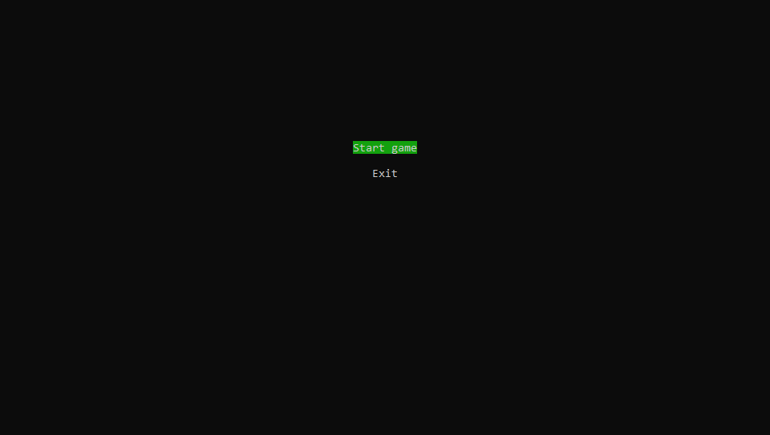

Студент-первокурсник.

# Подробное описание игры
В данном проекте разрабатывается игра "Змейка". Она представляет собой классическую игру, где управление осуществляется змейкой, которая перемещается по игровому полю, собирая еду и увеличивая свой размер.

Проект состоит из трех игровых сцен. Первая сцена - это главное меню, которое позволяет игрокам либо начать игру, либо выйти из неё.
Вторая сцена представляет собой окно настроек. В ней можно изменить разер игрового поля и скорости змеи.
Третья сцена - сама игра. Она представляет собой игровое поле, на котором змейка перемещается, собирая еду и увеличивая свой размер. Цель игры - набрать как можно больше очков, собирая еду и избегая границу, а также собственный хвост.

В проекте используется простая текстовая графика.

Идея этого проекта даёт возможность ученикам и студентам практически применить знания, полученные в процессе обучения, а также развить свои навыки программирования.

ЯП: Bash.

---

# Текст решения
В коде игры есть три главные функция, каждая из них соответствует выше написанным сценам.
1) mainMenuScene();
2) preGameScene();
3) gameScene();

В каждой из функции запущен бесконечный цикл, в котором рисуется графика и перехватывается ввод.
В 1 и 2 функции, команда read останавливает цикл до ввода, так как пока пользователь не нажмёт на какую-либо клавишу, а точнее W, S или Q, в кадре ничего менять не должно.
В 3 функции read ожидает 0.05 секунд и картинка обновляется.

__В 1 сцене две опции:__

    Start game
    Exit

__В 2 сцене 4 опции:__

    *Size of square: 8(размер поля)
    *Speed: 200(скорость змеи)

    Let's go(начать игру)
    Back(вернуться в меню)

_В этих двух сценах движения по опция происходит с помощью W и S, а значение меняется при помощи A(-) и D(+). Естественно при изменениях будет учитываться максимальные и минимальные значения каждого из параметров.(Как максимальный размер зависит от текущего размера окна консоли, так и скорость в переделах разумного. Изменение также происходят не по +1, а по удобным для пользователя и кода шагам.)_

__В 3 сцене:__

    Нажми Q, чтобы выйти
    Скорость змеи: 200, размер поля: 14
    Очков: 3
    Само поле
    Информация о победе и поражение(+причины).
    Что нажать, чтобы играть дальше или выйти.
    

---

# Функции
 $1=@1

__show_cursor()__ - _прячет курсор_

__hide_cursor()__ - _показывает курсор_

__generateGameField()__ - _генерирует игровое поле_

__line()__ - _делает линию длины @2 из @1 элементов_

__printGameData()__ - _выводит текст @1 по левой стороне игрвого поля_

__printCenter()__ - _выводит текст @1 по центру экрана_

__drawField()__ - _рисует поле_

__spawnCoin()__ - _спавнит монетки в рандомной свободной ячейки поля, если все монетки собранны_

__movePlayer()__ - _эта функция обновляет позицию игрока, взависимости от текущего направления. Также проверят, столкнулась ли змея со стенкой или с собой, если да то возращает 1 и 2. Если следующая ячейка монетка, то собирает. Также это функция обновляет массив поля(field), по которому рисуется поле._

__initGame()__ - _приведение к стандартным значением и инициализация_

__gameScene()__ - _3 сцена_

__preGameScene()__ - _2 сцена_

__mainMenuScene()__ - _1 сцена_
